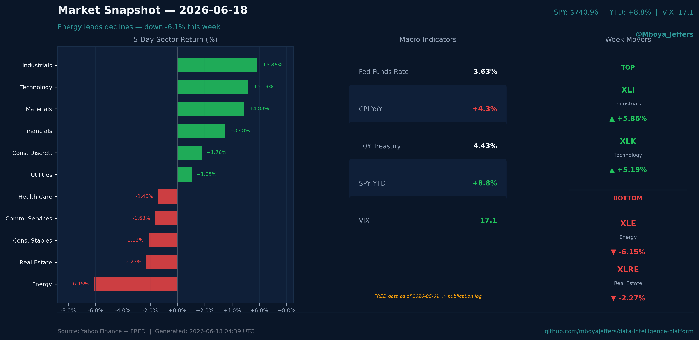
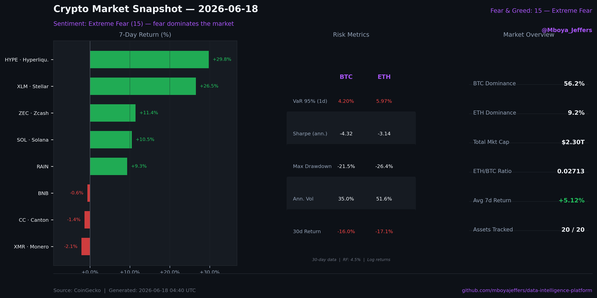
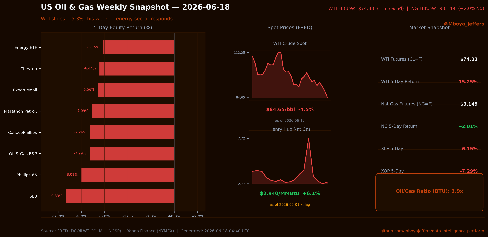
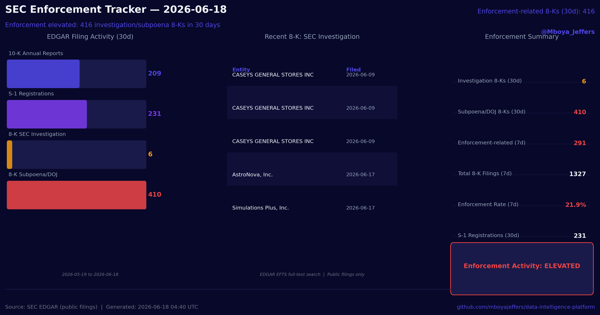
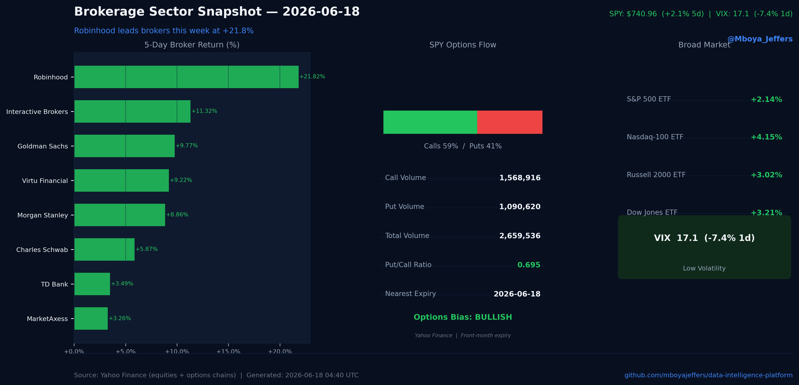
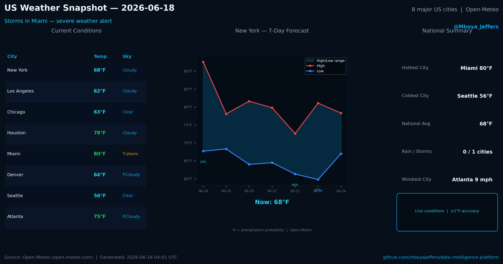

# X Market Data Bot — @Mboya_Jeffers

Automated daily market data cards posted to [@Mboya_Jeffers](https://x.com/Mboya_Jeffers).
11 verticals. Live API data. Monday–Friday 9AM ET.

> **Not investment advice. Data only.**

---

## Posting Schedule

| Day | Vertical | Data Sources |
|-----|----------|-------------|
| Monday | Finance | Yahoo Finance (sector ETFs) · FRED (10Y yield, Fed Funds, CPI) |
| Tuesday | Brokerage | Yahoo Finance (GS, MS, SCHW, options chains) · FRED (10Y yield) |
| Wednesday | Crypto | CoinGecko · alternative.me Fear & Greed |
| Thursday | Compliance | SEC EDGAR (AP, AAE forms, 8-K disclosures) |
| Friday | Rotating | See rotation table below |

**Friday 7-week rotation** (cycles by ISO week number):

| Week mod 7 | Vertical | Data Sources |
|-----------|----------|-------------|
| 0 | Oil & Gas | EIA via FRED (DCOILWTICO, MHHNGSP) · Yahoo Finance (NYMEX) |
| 1 | Betting | Yahoo Finance (DKNG, PENN, FLUT, BETZ ETF) |
| 2 | Solar | Yahoo Finance (FSLR, ENPH, TAN ETF) · FRED (WTI crude) |
| 3 | Gaming | Yahoo Finance (RBLX, TTWO, EA, ESPO ETF) |
| 4 | Media | Yahoo Finance (NFLX, DIS, SPOT, ROKU, FOXA, WBD) |
| 5 | E-Commerce | Yahoo Finance (AMZN, SHOP, EBAY, ETSY) · FRED (UMCSENT) |
| 6 | Weather | Open-Meteo (8 US cities, WMO-compliant, no key required) |

---

## Data Sources

| Source | What | Auth |
|--------|------|------|
| [Yahoo Finance](https://finance.yahoo.com) via yfinance | EOD prices, 5d returns, options chains | None |
| [FRED](https://fred.stlouisfed.org) (Federal Reserve) | 10Y yield, Fed Funds, CPI, WTI crude, Henry Hub, consumer sentiment | None |
| [CoinGecko](https://coingecko.com) | Crypto market caps, prices, 7d/30d returns, BTC dominance | None (public tier) |
| [alternative.me](https://alternative.me/crypto/fear-and-greed-index/) | Crypto Fear & Greed Index | None |
| [SEC EDGAR](https://efts.sec.gov) | Administrative Proceedings (AP), Accounting Enforcement (AAE), 8-K disclosures | None |
| [Open-Meteo](https://open-meteo.com) | Current conditions + 7-day forecast, 8 US cities | None |

All sources are free, publicly accessible, and require no API keys.

---

## Sample Cards

| Finance | Crypto | Oil & Gas |
|---------|--------|-----------|
|  |  |  |

| Compliance | Brokerage | Weather |
|------------|-----------|---------|
|  |  |  |

---

## Architecture

```
scripts/generate_*_x_card.py   # card generator per vertical (matplotlib/Agg)
bot/post.py                    # main dispatcher — card gen + caption + X API post
bot/post_cron.sh               # cron wrapper (sources credentials, logs to /tmp)
bot/post_friday.sh             # Friday rotation script (ISO week % 7)
cards/                         # generated PNG output (1600x900, 16:9)
schedule/                      # content calendar + posting schedule docs
```

**Cron (Mac, 9AM ET Monday–Friday):**
```
0 9 * * 1  post_cron.sh finance
0 9 * * 2  post_cron.sh brokerage
0 9 * * 3  post_cron.sh crypto
0 9 * * 4  post_cron.sh compliance
0 9 * * 5  post_friday.sh
```

---

## Tech Stack

- Python 3.11+ · matplotlib · yfinance · tweepy 4.x
- FRED REST API · CoinGecko public API · SEC EDGAR EFTS · Open-Meteo API
- Mac cron (launchd-compatible) · zsh wrapper scripts

---

## Usage

```bash
# dry run (no post — preview caption + card path)
python3 bot/post.py finance --dry-run
python3 bot/post.py crypto --dry-run

# live post (requires X API credentials in ~/.x_bot_env)
python3 bot/post.py finance
```

Credentials go in `~/.x_bot_env` (never committed):
```bash
X_API_KEY=
X_API_SECRET=
X_ACCESS_TOKEN=
X_ACCESS_TOKEN_SECRET=
```

---

*Part of the [data-intelligence-platform](https://github.com/mboyajeffers/data-intelligence-platform) — automated analytics across 11 industry verticals.*
